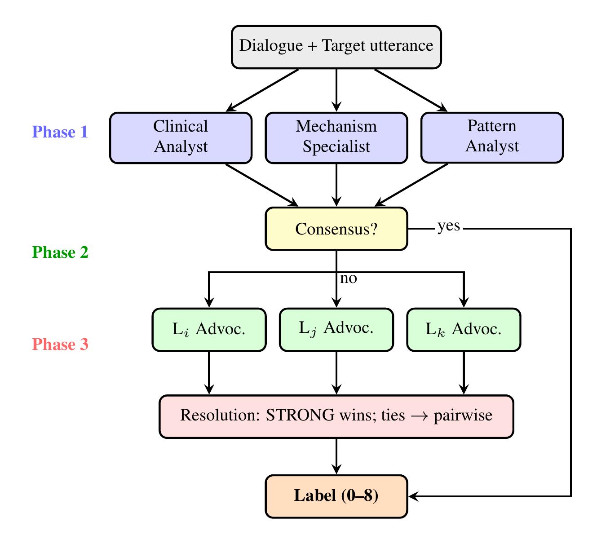

# Deliberative Council for Defense Mechanism Classification

> **2nd place** (F1 0.406) out of 63 teams at BioNLP 2026 PsyDefDetect.
> The council alone — zero fine-tuning, just prompts — scores F1 0.382 (top 5).

```bibtex
@inproceedings{galat-rizoiu-2026-uts,
  title     = {UTS at PsyDefDetect: Multi-Agent Councils and Absence-Based
               Reasoning for Defense Mechanism Classification},
  author    = {Galat, Dima and Rizoiu, Marian-Andrei},
  booktitle = {The 25th Workshop on Biomedical Natural Language Processing
               and BioNLP Shared Tasks},
  month     = jul,
  year      = {2026},
  address   = {San Diego, USA},
  publisher = {Association for Computational Linguistics}
}
```

LLMs are confidently wrong about defense mechanisms. When a therapy client says *"I lost my job last week"* with no visible distress, every model sees emotional content and calls it adaptive coping (Level 7). But the *absence* of proportional emotion is the signal — that's Isolation of Affect (Level 6).

This system fixes that by encoding clinical reasoning as prompt rules and resolving disagreements through evidence, not votes.

## How it works

<p align="center">
  
</p>

Three specialist agents classify in parallel (**Phase 1**). If they disagree, class-specific advocates rate evidence as STRONG / MODERATE / WEAK (**Phase 2**). Resolution picks by evidence quality, not vote count (**Phase 3**). 3–10 LLM calls per sample.

The key: advocates don't vote, they rate **evidence strength**. A minority class with one STRONG rating beats a majority class with two MODERATEs. This is what makes it *deliberative* — and what stops L7 from winning every time.

## The core insight (+11.7pp F1)

Defense mechanisms are defined by what's **absent**, not what's present. We encode this as an *affect-cognition integration spectrum*:

| What's happening | Level | Example |
|-----------------|-------|---------|
| Cognition present, affect *drained* | L6 | "I lost my job" — flat, factual, no emotion |
| Affect present, cognition *blocked* | L5 | "I'm just so sad" — can't say why |
| Cognition *distorts* reality | L2–4 | "I'm a complete failure" — absolute, no nuance |
| Affect + cognition *integrated* | L7 | "I feel scared but I'm working through it" |

The single most impactful rule: **Reporting vs. Processing**. Painful facts without proportional emotion = L6, not L7. Without it, LLMs default to L7 because therapy talk *looks like* coping.

## Quick start

```bash
uv sync
export GOOGLE_API_KEY=your-key-here

# predict
uv run python run.py --test-path data/test.json --train-path data/train.json

# evaluate on a training subset
uv run python run.py --eval-on-train --limit 50

# score a prediction file (no API calls)
uv run python run.py evaluate --gold data/train.json --pred prediction.json
```

Uses Gemini 2.5 Flash for agents, Gemini 2.5 Pro for resolution. Override with `--model` / `--moderator-model`.

## What's in the box

```
├── run.py                    CLI entry point
├── src/
│   ├── council.py            the deliberative council (3 phases, ~1300 lines)
│   ├── config.py             DMRS taxonomy: 9 levels, 30+ mechanisms, 100+ behavioral items
│   ├── retriever.py          TF-IDF + MMR few-shot retrieval with leakage prevention
│   └── evaluate.py           macro-F1, per-class metrics, confusion matrix
├── prompts/                  all 9 prompts as plain text for easy reading
│   ├── clinical_analyst.txt        Phase 1: psychodynamic reasoning
│   ├── mechanism_specialist.txt    Phase 1: systematic mechanism screening
│   ├── pattern_analyst.txt         Phase 1: analogical reasoning with examples
│   ├── class_advocate.txt          Phase 2: evidence-strength evaluation
│   ├── pairwise_resolver.txt       Phase 3: head-to-head comparison
│   ├── deliberation_moderator.txt  Phase 3: fallback arbitration
│   ├── rules_handbook.txt          7 clinical classification rules
│   ├── rules_l7_gate.txt           L7 verification gate
│   └── rules_confusion_watchlist.txt  8 commonly confused class pairs
├── data/                     place train.json and test.json here
└── pyproject.toml
```

The `prompts/` directory mirrors what's in `council.py` — read them there, edit them in the code.

## The L7 attractor problem

Level 7 is 52% of training data. The L7 advocate rates STRONG 73% of the time vs. 32–43% for other classes. Result: 54% of all stable errors are incorrect L7 predictions. Every minority class leaks toward L7.

Vote-based resolution can't fix this — L7 always outnumbers. Evidence-based resolution can: a minority class with STRONG evidence beats L7 with MODERATE, regardless of how many agents proposed L7.

## Data

From the [PsyDefDetect shared task](https://www.codabench.org/competitions/12124). Place `train.json` and `test.json` in `data/`.

## License

MIT
